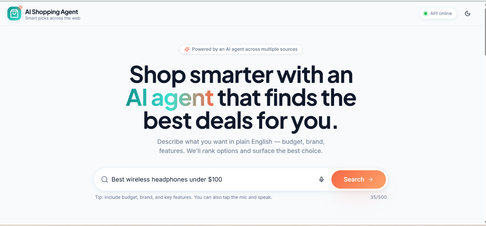
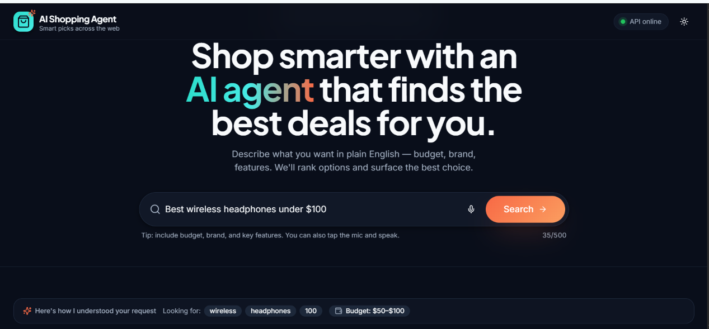

# AI Shopping Agent

Describe what you want to buy in plain English, by typing or by voice. The agent understands your budget
and keywords, searches Amazon through a live API, and returns ranked results with a clearly explained
best choice.

**Live demo:** _coming soon_




## What it does

- **Natural-language search.** "Lightweight gaming laptop, RTX 4060, under $1500" becomes keywords plus a budget.
  Model numbers such as `4060` are kept; budget text never leaks into the product query.
- **Budget as a range.** "Under $100" searches roughly $50-$100, and "around $100" searches $80-$120, so a
  $100 budget does not fill the page with $15 items. The applied range is shown in the UI.
- **"Here's how I understood your request" strip.** The agent shows the keywords and budget it extracted.
- **Real prices and real discounts.** Discounts are computed from Amazon's list price. Implausible list prices
  (over 70% off) are ignored instead of advertised.
- **Ranking you can explain.** Rating is weighted by review count (so 5.0 with 3 reviews does not beat 4.6 with
  29,000 reviews), blended with price and how well the title matches the request. Earbuds are not ranked as
  headphones unless you ask for them.
- **Colour variants merged.** Five colours of the same headphones become one card with a "5 variants" badge.
- **Highlights.** Cards can show "Lowest price", "Most reviewed" and "Top rated".
- **Sort and filter.** By price, rating, discount, store, and over-budget items.
- **Voice search.** Browser speech recognition (Chrome and Edge), no extra service or API key.
- **Small talk.** Greetings get a friendly reply and example searches instead of random products.
- **Honest empty states.** When nothing matches, the agent says so. There is no fake demo data.
- **Dark mode.**

## How it works

```
query -> parse (heuristics + optional Groq) -> budget range
      -> retrieve: MongoDB -> Amazon via RapidAPI -> optional eBay scraper (Playwright)
      -> normalize -> budget filter -> merge variants
      -> rank (reviews-weighted rating, price, title relevance) -> best choice
```

Groq is used only to understand the query and to answer greetings. Ranking is a transparent formula, not a
language-model guess.

## Tech stack

| Layer    | Tools |
|----------|-------|
| Backend  | Python, FastAPI, LangGraph, Groq (`openai/gpt-oss-20b`), MongoDB, Playwright |
| Data     | RapidAPI "Real-Time Amazon Data" (Amazon US) |
| Frontend | React, TypeScript, Vite, Tailwind CSS, shadcn/ui, react-markdown |

## Project structure

```
backend/
  app/
    agent/      parser, intent (small talk), tools, LangGraph flow
    config/     settings (environment variables)
    db/         MongoDB access
    models/     request and response schemas
    routes/     POST /api/shopping/search, ranking
    services/   RapidAPI client, eBay scraper
frontend/
  src/
    components/ UI (cards, toolbar, strips, header)
    hooks/      speech recognition, toasts
    lib/        API client, formatting, highlights
    pages/      main page
    types/      shared TypeScript types
```

## Run locally

### Backend

```bash
cd backend
python -m venv .venv
# Windows: .\.venv\Scripts\activate    macOS/Linux: source .venv/bin/activate
pip install -r requirements.txt
cp .env.example .env        # Windows PowerShell: Copy-Item .env.example .env
# fill in RAPIDAPI_KEY (required for live results) and GROQ_API_KEY (optional)
uvicorn app.main:app --reload --host 127.0.0.1 --port 8000
```

Check `http://127.0.0.1:8000/health`; interactive docs are at `/docs`.

The eBay scraper is optional and needs a browser: `python -m playwright install chromium`. If it is not
installed, the scraper step simply returns nothing and the rest of the pipeline continues.

### Frontend

```bash
cd frontend
cp .env.example .env        # sets VITE_API_URL=http://localhost:8000
npm install
npm run dev                 # http://localhost:8080
```

### Environment variables (backend)

| Variable | Purpose |
|----------|---------|
| `RAPIDAPI_KEY`, `RAPIDAPI_HOST` | Amazon product data (required for live results) |
| `GROQ_API_KEY`, `GROQ_MODEL` | Query understanding and small talk (optional; heuristics are used without it) |
| `MONGODB_URI`, `MONGODB_DB`, `MONGODB_COLLECTION` | Optional first search source |
| `PKR_PER_USD`, `INR_PER_USD` | Approximate rates for budgets written in PKR or INR |

Never commit `.env`. It is git-ignored; `.env.example` is the template.

## API

`POST /api/shopping/search`

```json
{ "query": "best wireless headphones under $100" }
```

Returns `products`, `best_choice`, `recommendation`, `message`, `markdown_result`, `keywords`,
`budget_note`, `suggestions`, and `intent` (`shopping`, `chat`, `no_results` or `error`).

## Limitations

- Prices come from the **Amazon US** store, in **USD**. Shipping, import charges and availability in your own
  country are not included, and they can change what you pay.
- Some listings have no price in Amazon's search data. Those show "Check price at store".
- Live results depend on the RapidAPI plan and its request quota.
- Product titles are matched by text, so specifications such as GPU model are not verified beyond the title.
